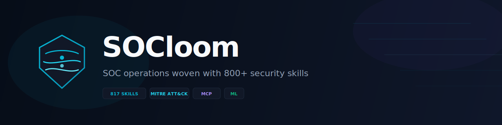
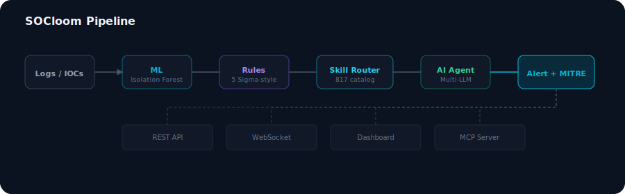
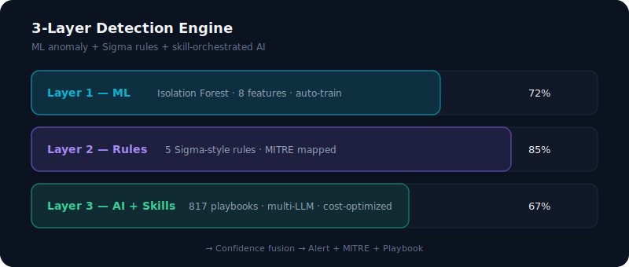
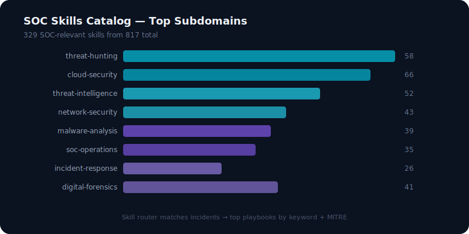
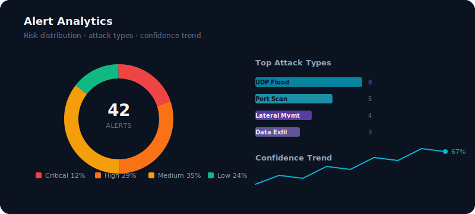

<p align="center">
  
</p>

<p align="center">
  
</p>

<p align="center">
  
  
  
  
  
  
  
</p>

<h3 align="center">SOC operations woven with 800+ security skills, ML detection & MITRE ATT&CK</h3>

<p align="center">
  <a href="#quick-start">Quick Start</a> •
  <a href="docs/ARCHITECTURE.md">Architecture</a> •
  <a href="docs/API.md">API</a> •
  <a href="docs/CLI.md">CLI</a> •
  <a href="docs/MCP.md">MCP</a> •
  <a href="docs/DEPLOYMENT.md">Deploy</a>
</p>

---

## Overview

**SOCloom** is an open-source, AI-native Security Operations Center platform. It weaves together three detection layers, a catalog of **817 cybersecurity skills**, and **MITRE ATT&CK** mapping into one analyst toolchain.

Most AI-SOC tools dump logs into an LLM. SOCloom **routes each incident through real security playbooks** — threat hunting, IR, forensics, malware analysis — then fuses that context with ML scores before generating a response.

<p align="center">
  
</p>

---

## Why SOCloom?

| Problem | SOCloom Solution |
|---------|------------------|
| Alert fatigue | ML + rules fusion with confidence scoring |
| Shallow AI triage | 817-skill router injects real playbooks into LLM context |
| No MITRE context | Auto-maps every alert to ATT&CK + IR playbooks |
| Vendor lock-in | Open source, self-hosted, multi-LLM |
| AI agent gap | Native MCP server for Cursor & Claude Desktop |

---

## Detection Engine

<p align="center">
  
</p>

| Layer | Technology | Purpose |
|-------|-----------|---------|
| **ML** | Isolation Forest (8 features) | Baseline anomaly detection |
| **Rules** | 5 Sigma-style rules | Deterministic high-fidelity alerts |
| **AI + Skills** | Multi-LLM + 817 playbooks | Contextual threat analysis |

---

## Skills Catalog

<p align="center">
  
</p>

- **817** total skills indexed from [Anthropic Cybersecurity Skills](https://github.com/mukul975/Anthropic-Cybersecurity-Skills)
- **329** SOC-relevant across threat hunting, IR, forensics, malware analysis
- Semantic router matches incidents by keyword, attack type, and MITRE technique

---

## Dashboard Analytics

<p align="center">
  
</p>

Real-time React dashboard with risk distribution, attack type breakdown, confidence trends, and WebSocket live alerts.

---

## Quick Start

### Prerequisites

Python 3.11+ · Node.js 20+ (dashboard) · [Anthropic Cybersecurity Skills](https://github.com/mukul975/Anthropic-Cybersecurity-Skills) (optional)

### Install & run

```bash
git clone https://github.com/xAmirHamza77/SOCLOOM.git
cd SOCLOOM
cp .env.example .env

python3.12 -m venv .venv && source .venv/bin/activate
pip install -r requirements.txt

# API server
PYTHONPATH=backend uvicorn aegis.main:app --reload --port 8000

# Dashboard (new terminal)
cd frontend && npm install && npm run dev

# Demo traffic (new terminal)
python scripts/traffic_simulator.py
```

| Service | URL |
|---------|-----|
| Dashboard | http://localhost:5173 |
| API docs | http://localhost:8000/docs |
| Health | http://localhost:8000/api/v1/health |

---

## CLI

```bash
export PYTHONPATH=backend

python -m aegis.cli.main analyze --src 203.0.113.55 --dst 10.0.0.5 -p UDP -s 7000 -d 30
python -m aegis.cli.main hunt "dns tunneling exfiltration"
python -m aegis.cli.main intel "203.0.113.55,evil-domain.com"
python -m aegis.cli.main incident "Ransomware Alert" --desc "Encrypted files on FS-01"
python -m aegis.cli.main skills --stats
```

---

## MCP Server

```bash
pip install mcp
PYTHONPATH=backend python mcp-server/server.py
```

Expose SOCloom to Cursor, Claude Desktop, and AI agents. See [docs/MCP.md](docs/MCP.md).

---

## Docker

```bash
docker compose up --build
```

---

## Project Structure

```
socloom/
├── assets/              # Logo, banner, charts (SVG)
├── backend/aegis/       # Core engine
├── frontend/            # React dashboard
├── mcp-server/          # MCP for AI agents
├── scripts/             # Traffic simulator
└── docs/                # Full documentation
```

---

## Configuration

| Variable | Description | Default |
|----------|-------------|---------|
| `AEGIS_SKILLS_PATH` | Anthropic skills repo path | built-in fallback |
| `OPENAI_API_KEY` | OpenAI key | — |
| `ANTHROPIC_API_KEY` | Anthropic key | — |
| `AEGIS_LLM_PROVIDER` | `openai` / `anthropic` / `ollama` | `openai` |
| `ABUSEIPDB_API_KEY` | IP reputation | — |

Works fully offline without API keys.

---

## Roadmap

- [x] ML + rules + skill-orchestrated AI
- [x] 817-skill catalog router
- [x] MITRE ATT&CK mapping
- [x] MCP server + CLI + Dashboard
- [ ] Sigma YAML import
- [ ] STIX/TAXII feeds
- [ ] JWT auth + RBAC
- [ ] SOAR integrations

---

## Acknowledgments

- [Ai-socAnalyst](https://github.com/kartavya0203/Ai-socAnalyst) — ML pipeline & dashboard
- [Anthropic Cybersecurity Skills](https://github.com/mukul975/Anthropic-Cybersecurity-Skills) — 817 security workflows

## License

MIT — see [LICENSE](LICENSE)

<p align="center">
  <sub>If SOCloom helps your team, give it a ⭐ on GitHub</sub>
</p>